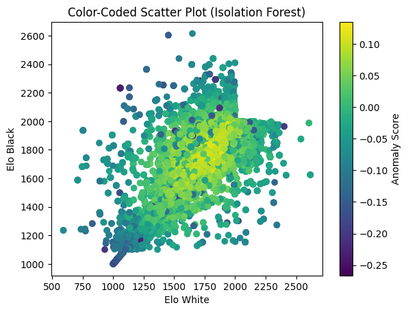
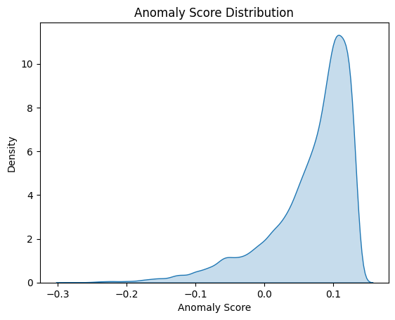
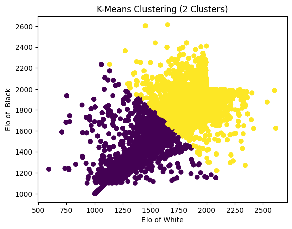

# Anomaly Detection in Online Chess
📘 Notebook

Click below to view the full implementation:

👉 View the Analysis Notebook

📁 Dataset
Dataset Folder in Repository

👉 Open Dataset Folder

Original Source Dataset

This dataset is publicly available on Kaggle:
👉 !Link provided inside(dataset/links.txt)

📊 Key Visualisations

Below are the three most important visual insights generated during the project:

1. Isolation Forest – Anomaly Score Distribution

Shows the right-skewed anomaly score distribution indicating most games are normal with a detectable anomalous tail.
👉 View Visual

2. K-Means Cluster Scatter Plot

Shows Elo-driven clusters and highlights the algorithm’s limitation in detecting cheats based purely on clustering.
👉 View Visual

3. Elo White vs Elo Black Scatter (with Anomaly Scores)

Displays how Elo similarity influences anomaly likelihood, with outliers signalling unusual matchups.
👉 View Visual

📄 Detailed Thesis Summary

For a deeper summary of the study, methodology, results and academic insights:

👉 Read Full Thesis Summary

📚 Full Thesis (PDF)

(Only include this if you uploaded it)

👉 Download Full Thesis

🧠 Key Findings (Short Version)

Isolation Forest is highly effective at detecting anomalies in chess datasets

Flagged moves (white/black) are the strongest predictors

A threshold of ~25 flagged moves strongly indicates potential cheating

Elo influences anomalies—but in complex, non-linear ways

K-Means shows poor performance in identifying cheating patterns

Unsupervised methods provide solid results even without labelled data

🛠 Technologies Used

Python, Pandas, NumPy

Scikit-Learn (IsolationForest, KMeans)

Matplotlib

Google Colab

Kaggle Dataset

## 📊 Key Visualisations

### Isolation Forest — Elo White vs Elo Black

### Anomaly Score Distribution

### K-Means Clustering — Elo Distribution

